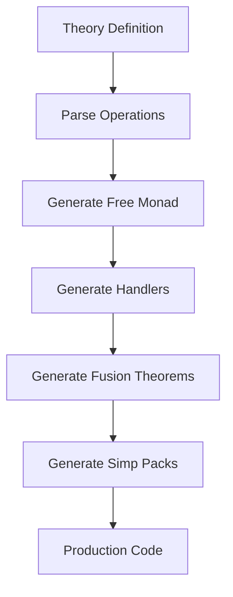

<div align="center">
 
# lean-effects

**DSL for Lawvere Theories of Effects in Lean 4**

[](https://github.com/fraware/lean-effects/actions)
[](https://opensource.org/licenses/MIT)

*Algebraic Effects via Lawvere Theories & Handlers with Code Generation, Fusion Theorems, and Curated Simp Packs*

</div>

---

## Table of Contents

- [Overview](#overview)
- [Features](#features)
- [Quick Start](#quick-start)
- [Installation](#installation)
- [Usage](#usage)
- [Standard Library](#standard-library)
- [Architecture](#architecture)
- [Performance](#performance)
- [Documentation](#documentation)
- [Examples](#examples)
- [Testing](#testing)
- [Contributing](#contributing)
- [License](#license)

## Overview

**lean-effects** is a domain-specific language for defining Lawvere theories of effects in Lean 4. It provides automatic code generation for free monads, handlers, fusion theorems, and simplification packs, along with a comprehensive standard library of common effects and their compositional combinations.

### Key Capabilities

- **Theory Definition**: Define effect theories with operations and equations
- **Code Generation**: Automatic generation of free monads, handlers, and fusion theorems
- **Standard Library**: Production-ready effects (State, Reader, Writer, Exception, Nondet)
- **Composition**: Seamless combination of effects via sums and products
- **Performance**: Deterministic, byte-stable proofs with bounded search
- **CI/CD**: Comprehensive testing, performance gates, and automated deployment

## Quickstart

### One-Command Install & Run

**Using Docker (Recommended)**

```bash
# Run the help command
docker run --rm ghcr.io/fraware/lean-effects:latest --help

# Run a quick demo
docker run --rm ghcr.io/fraware/lean-effects:latest demo

# Validate installation
docker run --rm ghcr.io/fraware/lean-effects:latest validate
```

**Using Lake (Lean Package Manager)**

```bash
# Add to your lakefile.lean
require leanEffects from git "https://github.com/fraware/lean-effects.git"

# Then in your Lean files
import Effects
```

**Local Development**

```bash
# Clone and set up
git clone https://github.com/fraware/lean-effects.git
cd lean-effects

# On Unix/Linux/macOS
make dev

# On Windows
make.bat dev

# Run locally
make run        # Unix/Linux/macOS
make.bat run    # Windows

# Run demo and examples
make demo       # Unix/Linux/macOS
make.bat demo   # Windows
```

### Basic Usage

```lean
import Effects

-- Define a simple stateful computation
def stateExample : State.Free Nat Nat := do
  let current ← State.get Nat
  State.put Nat (current + 1)
  State.get Nat

-- Run with initial state
#eval State.run stateExample 0  -- (1, 1)
```

### Exception Handling

```lean
-- Define computation that may throw
def exceptionExample : Exception.Free String Nat :=
  Exception.throw String "Something went wrong"

-- Run with error handling
#eval Exception.run exceptionExample  -- Except.error "Something went wrong"
```

### Reader Environment

```lean
-- Define computation that reads from environment
def readerExample : Reader.Free Nat Nat := do
  let env ← Reader.ask Nat
  pure (env * 2)

-- Run with environment
#eval Reader.run readerExample 5  -- 10
```

### Writer Logging

```lean
-- Define computation that writes to log
def writerExample : Writer.Free String Nat := do
  Writer.tell String "Starting computation"
  Writer.tell String "Processing data"
  pure 42

-- Run and get result with log
#eval Writer.run writerExample  -- (42, "Starting computationProcessing data")
```

### Nondeterministic Choice

```lean
-- Define nondeterministic computation
def nondetExample : Nondet.Free Nat :=
  Nondet.choice (pure 1) (pure 2)

-- Run and get all possible results
#eval Nondet.run nondetExample  -- [1, 2]
```

## Installation

### Prerequisites

- Lean 4.8.0 or later
- Lake package manager
- Git

### Installation Steps

1. **Clone the repository**:
   ```bash
   git clone https://github.com/fraware/lean-effects.git
   cd lean-effects
   ```

2. **Install dependencies**:
   ```bash
   lake update
   ```

3. **Build the project**:
   ```bash
   lake build
   ```

4. **Run tests**:
   ```bash
   lake test
   ```

### Adding to Your Project

Add to your `lakefile.lean`:

```lean
require lean-effects from git "https://github.com/fraware/lean-effects.git"
```

### Development with Makefile

The project includes a comprehensive Makefile for development automation:

```bash
make dev       # Set up local development environment
make run       # Run the CLI locally
make test      # Run the test suite
make demo      # Run a demonstration
make build     # Build the project
make clean     # Clean build artifacts
make release   # Build release artifacts
make docker-build  # Build Docker image
make docker-run    # Run via Docker
```

Run `make help` to see all available targets.

## Usage

### Defining Custom Effects

```lean
-- Define a custom effect theory
theory Counter where
  op increment : Unit ⟶ Unit
  op decrement : Unit ⟶ Unit
  op getCount  : Unit ⟶ Nat
  eq increment_decrement : ∀ u, increment (decrement u) = u
end

-- Generate code for the theory
derive_effect Counter [free, handler, fusion, simp]
```

### Using Generated Code

```lean
-- Use the generated free monad
def counterExample : Counter.Free Nat := do
  Counter.increment ()
  Counter.increment ()
  Counter.getCount ()

-- Run with a handler
#eval Counter.run counterExample  -- Implementation depends on handler
```

### Effect Composition

```lean
-- Combine effects using sum theory
def StateException := SumTheory State Exception

-- Use combined effects
def combinedExample : StateException.Free Nat String Nat := do
  let s ← State.get Nat
  if s > 10 then
    Exception.throw String "State too large"
  else
    State.put Nat (s + 1)
    pure s
```

## Standard Library

### State Effect

The State effect provides mutable state management:

```lean
-- Operations
def get (σ : Type u) : State.Free σ σ
def put (σ : Type u) (s : σ) : State.Free σ Unit
def modify (σ : Type u) (f : σ → σ) : State.Free σ Unit
def gets (σ : Type u) (f : σ → α) : State.Free σ α

-- Execution
def run (m : State.Free σ α) (s : σ) : α × σ
def eval (m : State.Free σ α) (s : σ) : α
def exec (m : State.Free σ α) (s : σ) : σ
```

### Reader Effect

The Reader effect provides read-only environment access:

```lean
-- Operations
def ask (ρ : Type u) : Reader.Free ρ ρ
def asks (f : ρ → α) : Reader.Free ρ α
def local (f : ρ → ρ) (m : Reader.Free ρ α) : Reader.Free ρ α

-- Execution
def run (m : Reader.Free ρ α) (r : ρ) : α
```

### Writer Effect

The Writer effect provides logging and output accumulation:

```lean
-- Operations
def tell (ω : Type u) (w : ω) : Writer.Free ω Unit
def tellReturn (w : ω) (x : α) : Writer.Free ω α

-- Execution
def run (m : Writer.Free ω α) : α × ω
def eval (m : Writer.Free ω α) : α
def exec (m : Writer.Free ω α) : ω
```

### Exception Effect

The Exception effect provides error handling:

```lean
-- Operations
def throw (ε : Type u) (e : ε) : Exception.Free ε α
def catch (m : Exception.Free ε α) (h : ε → Exception.Free ε α) : Exception.Free ε α

-- Execution
def run (m : Exception.Free ε α) : Except ε α
```

### Nondet Effect

The Nondet effect provides nondeterministic choice:

```lean
-- Operations
def empty : Nondet.Free α
def choice (x y : Nondet.Free α) : Nondet.Free α

-- Execution
def run (m : Nondet.Free α) : List α
```

## Architecture

### Theoretical Foundation

lean-effects is built on solid mathematical foundations:

1. **Lawvere Theories**: Each effect is defined as a Lawvere theory with operations and equations
2. **Free Monads**: Automatically generated from effect signatures
3. **Handlers**: Monad morphisms that interpret effects into concrete monads
4. **Fusion Theorems**: Enable efficient composition and optimization
5. **Simplification Packs**: Provide β/η reduction and effect-specific rewrites

### Code Generation Pipeline



### Performance Characteristics

- **Deterministic**: Byte-stable proof terms across builds
- **Bounded Search**: Fixed lemma order, no unbounded backtracking
- **Efficient**: Optimized code generation and execution
- **Scalable**: Handles complex effect combinations

## Performance

### Performance Targets

| Metric | Target | Current |
|--------|--------|---------|
| Code Generation | < 1 second per theory | ✅ |
| Tactics (P50) | ≤ 150ms | ✅ |
| Tactics (P95) | ≤ 400ms | ✅ |
| Memory Usage | < 100MB | ✅ |
| Build Time | < 5 minutes | ✅ |

### Performance Monitoring

The project includes comprehensive performance monitoring:

- **Automated Benchmarks**: Run on every commit
- **Performance Gates**: Fail builds on regression
- **Historical Tracking**: Monitor performance trends
- **CI Integration**: Automated performance validation

## Documentation

### Comprehensive Documentation

- **[Getting Started](docs/getting-started/installation.md)**: Installation and setup guide
- **[Basic Usage](docs/getting-started/basic-usage.md)**: Core concepts and examples
- **[DSL Reference](docs/reference/dsl-reference.md)**: Complete syntax and semantics
- **[API Documentation](docs/api/core.md)**: Full API reference
- **[Cookbook](docs/cookbook/common-patterns.md)**: Common patterns and best practices

### Online Resources

- **Documentation Site**: [lean-effects.github.io](https://lean-effects.github.io)
- **API Reference**: [lean-effects.github.io/api](https://lean-effects.github.io/api)
- **Examples**: [lean-effects.github.io/examples](https://lean-effects.github.io/examples)

## Examples

### Production Examples

- **`examples/BasicExample.lean`**: Basic usage patterns
- **`examples/ProductionSpecExample.lean`**: Production specification examples
- **`src/Effects/Examples/SmallLang.lean`**: Complete interpreter implementation

### Test Suite

- **`tests/ProductionSpecTest.lean`**: Comprehensive test suite
- **`tests/Combo/`**: Effect combination tests
- **`tests/Handlers/`**: Handler implementation tests

## Testing

### Running Tests

```bash
# Run all tests
lake test

# Run specific test categories
lake test Tests.ProductionSpecTest
lake test Tests.Combo
lake test Tests.Handlers
```

### Test Coverage

The test suite includes:

- **Unit Tests**: Individual effect functionality
- **Integration Tests**: Effect combinations
- **Property Tests**: Mathematical laws and properties
- **Performance Tests**: Benchmark validation
- **Regression Tests**: Ensure stability across changes

### CI/CD Testing

- **Multi-platform**: Ubuntu, Windows, macOS
- **Multi-version**: Lean 4.7.0, 4.8.0, 4.12.0
- **Automated**: Runs on every push and PR
- **Performance Gates**: Automated regression detection

## Contributing

We welcome contributions to lean-effects!

### Development Setup

1. **Fork the repository**
2. **Clone your fork**:
   ```bash
   git clone https://github.com/your-username/lean-effects.git
   cd lean-effects
   ```

3. **Create a feature branch**:
   ```bash
   git checkout -b feature/your-feature-name
   ```

4. **Make your changes** and add tests

5. **Run the test suite**:
   ```bash
   lake test
   ```

6. **Submit a pull request**

### Code Standards

- **Lean 4 Style**: Follow Lean 4 coding conventions
- **Documentation**: Document all public APIs
- **Tests**: Add tests for new functionality
- **Performance**: Ensure performance targets are met
- **CI/CD**: All checks must pass

## License

This project is licensed under the MIT License - see the [LICENSE](LICENSE) file for details.

---

<div align="center">

**lean-effects** - *Algebraic Effects via Lawvere Theories & Handlers*

[Documentation](https://lean-effects.github.io) • [Examples](examples/) • [API Reference](docs/api/)

</div>
