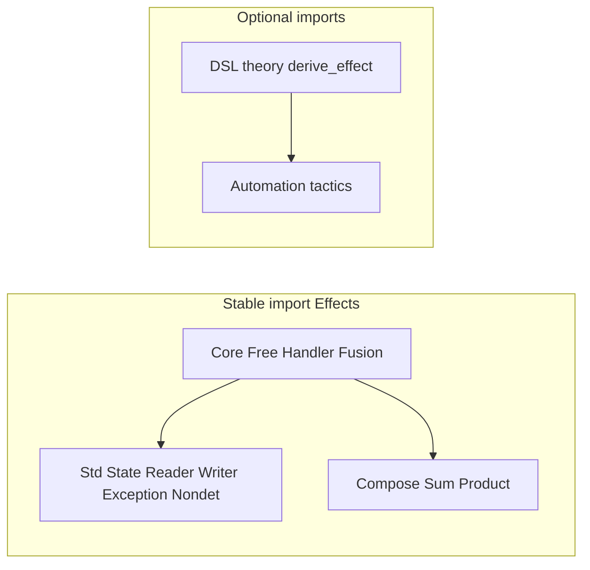

<div align="center">

# lean-effects

### Algebraic effects in Lean 4

**Lawvere theories · free monads · handlers · fusion · tactics**

[](https://github.com/fraware/lean-effects/actions/workflows/ci.yml)
[](https://opensource.org/licenses/MIT)
[](lean-toolchain)

<br />

[Quick start](#quick-start) · [Install](#install) · [Documentation](#documentation) · [Contributing](CONTRIBUTING.md)

</div>

---

> **lean-effects** helps you describe effects with operations and laws, write programs in a free monad, run them with handlers, and prove things using bundled simplification rules and tactics.  
> It includes **State**, **Reader**, **Writer**, **Exception**, and **Nondet**, ways to combine them, and works with **Mathlib** on a fixed **Lean** version (see `lean-toolchain`).

---

## Why lean-effects

| | |
|:---|:---|
| **Theories** | Operations and laws stay in one place so programs and proofs stay aligned. |
| **Programs** | A standard free monad with `bind`, lemmas, and the usual monad interface. |
| **Handlers** | Run those programs in the monad you choose, with correctness conditions built in. |
| **Proof help** | Tactics such as `effect_fuse!` and `handler_laws!`, plus simp sets for common steps. |
| **Ready-made effects** | State, environment, logging, errors, and nondeterminism, plus combination examples. |

---

## Minimal example

```lean
import Effects

def stateExample : State.Free Nat Nat := do
  let current ← State.get Nat
  State.put Nat (current + 1)
  State.get Nat

#eval State.run stateExample 0   -- (1, 1)
```

<details>
<summary><strong>More one-liners</strong> (Reader, Writer, Exception, Nondet)</summary>

```lean
import Effects

-- Reader
#eval Reader.run (do let e ← Reader.ask Nat; pure (e * 2)) 5   -- 10

-- Writer (log type ω needs a Monoid instance, e.g. String)
#eval Writer.run (do Writer.tell String "hi"; pure 42)           -- (42, "hi")

-- Exception
#eval Exception.run (Exception.throw String "oops")            -- Except.error "oops"

-- Nondet.choice takes two plain α values, not sub-computations
#eval Nondet.run (Nondet.choice 1 2)                           -- [1, 2]
```

</details>

---

## Quick start

<table>
<tr>
<td width="33%" valign="top"><strong>Docker</strong></td>
<td width="33%" valign="top"><strong>Depend on it</strong></td>
<td width="33%" valign="top"><strong>Clone it</strong></td>
</tr>
<tr>
<td valign="top">

```bash
docker run --rm ghcr.io/fraware/lean-effects:latest --help
docker run --rm ghcr.io/fraware/lean-effects:latest demo
```

</td>
<td valign="top">

```lean
require lean-effects from git
  "https://github.com/fraware/lean-effects.git" @ "main"

-- in your .lean files:
import Effects
```

</td>
<td valign="top">

```bash
git clone https://github.com/fraware/lean-effects.git
cd lean-effects
lake update && lake build
lake exe lean-effects --help
```

*Unix/macOS:* `make dev` · *Windows:* `make.bat dev`

</td>
</tr>
</table>

---

## Install

| Step | What to do |
|------|------------|
| 1 | Install [elan](https://github.com/leanprover/elan) and open this repo so the `lean-toolchain` file is used. |
| 2 | Run `lake update`. If downloads fail (e.g. in Docker), see [CONTRIBUTING](CONTRIBUTING.md). |
| 3 | Run `lake build Effects` and `lake build Tests` (or `lake build` for everything including benchmarks and CLI). |

Optional: `make help` for more targets.

---

## Standard effects (at a glance)

| Effect | Code | Role |
|--------|------|------|
| **State** | [`State.lean`](src/Effects/Std/State.lean) | `get` / `put` / `modify` / `gets` / `run` / `eval` / `exec` |
| **Reader** | [`Reader.lean`](src/Effects/Std/Reader.lean) | `ask`, `local`, `run` |
| **Writer** | [`Writer.lean`](src/Effects/Std/Writer.lean) | `tell`, `run` / `eval` / `exec` (log type needs a monoid) |
| **Exception** | [`Exception.lean`](src/Effects/Std/Exception.lean) | `throw`, `catch`, `run` → `Except` |
| **Nondet** | [`Nondet.lean`](src/Effects/Std/Nondet.lean) | `empty`, `choice`, `run` → `List` |

**Combining effects:** [`Sum.lean`](src/Effects/Compose/Sum.lean), [`Product.lean`](src/Effects/Compose/Product.lean). Examples: [`tests/Combo/`](tests/Combo/).

---

## Custom theories (DSL)

Sketch of defining a theory and generating code (see [`src/Effects/DSL/`](src/Effects/DSL/) for the exact commands your build supports):

```lean
theory Counter where
  op increment : Unit ⟶ Unit
  op getCount  : Unit ⟶ Nat
end

derive_effect Counter [free, handler, fusion, simp]
```

---

## Architecture


```mermaid
flowchart LR
  subgraph stable [Stable import Effects]
    C[Core Free Handler Fusion]
    S[Std State Reader Writer Exception Nondet]
    P[Compose Sum Product]
  end
  subgraph optional [Optional imports]
    D[DSL theory derive_effect]
    A[Automation tactics]
  end
  C --> S
  C --> P
  D --> A
```

| Layer | Module | In `import Effects`? |
|-------|--------|----------------------|
| Core | `Effects.Core.*` | Yes — free monad, handlers, fusion |
| Std | `Effects.Std.*` | Yes — standard effects |
| Compose | `Effects.Compose.*` | Yes — sum and product |
| DSL | `Effects.DSL` | No — `import Effects.DSL` |
| Automation | `Effects.Automation` | No — `import Effects.Automation` |

`import Effects` is the CSLib-facing surface: core semantics and standard effects without DSL elaboration or tactics. For custom theories use `import Effects.DSL`; for `effect_fuse!` and related tactics use `import Effects.Automation`.

### Known proof debt

- One tracked `sorry` in `Effects.Std.Nondet` (`NondetT.runFree_bind` choice case); CI rejects any other `sorry` in `src/`.
- One `axiom mapConst` in `Effects.Core.SigUtil` for indexed operation signatures. See [`docs/EXTRACTION_LEDGER.md`](docs/EXTRACTION_LEDGER.md).

### Windows native link

Executables (`lake exe lean-effects`, `lake exe test-suite`) need a C compiler. On Windows, set `LEAN_CC=clang` (or another installed compiler) if `cc` is not on PATH. Linux CI builds library and tests without issue.

---

## Tests and CI

| | |
|:---|:---|
| **Proofs in `tests/`** | `lake build Tests` |
| **Extra executable checks** | `lake exe test-suite` |
| **Benchmarks** | `lake exe Bench` · `lake exe performance-monitor` |

Continuous integration builds `Effects` and `Tests` on Linux, runs executable checks, and refuses new `sorry` in `src/` (except the tracked gap in `Effects.Std.Nondet`). Dependency versions are set in [`lakefile.lean`](lakefile.lean) and [`lean-toolchain`](lean-toolchain) (`v4.31.0-rc1`).

---

## Repository layout

| Path | Purpose |
|------|---------|
| [`src/Effects/`](src/Effects/) | Library |
| [`tests/`](tests/) | Theorems and examples used as tests |
| [`examples/`](examples/) | Small demos |
| [`scripts/`](scripts/) | Extra programs invoked with `lake exe …` |
| [`docs/`](docs/) | Website source and [`mkdocs.yml`](docs/mkdocs.yml) |
| [`VERSION`](VERSION) | CLI version string (read in `Main.lean`) |

---

## Documentation

| | |
|:---|:---|
| [Installation](docs/pages/getting-started/installation.md) | Clone, build, common issues |
| [Basic usage](docs/pages/getting-started/basic-usage.md) | Concepts and snippets |
| [DSL reference](docs/pages/reference/dsl-reference.md) | Syntax |
| [Core API](docs/pages/api/core.md) | Where the main types live |
| [Cookbook](docs/pages/cookbook/common-patterns.md) | Patterns |
| [Extraction ledger](docs/EXTRACTION_LEDGER.md) | CSLib scope and proof debt |

Local site: `pip install -r docs/requirements.txt`, then `cd docs && mkdocs serve`.

**Examples:** [`examples/BasicExample.lean`](examples/BasicExample.lean), [`examples/ProductionSpecExample.lean`](examples/ProductionSpecExample.lean), [`src/Effects/Examples/SmallLang.lean`](src/Effects/Examples/SmallLang.lean).

---

## Contributing

See **[CONTRIBUTING.md](CONTRIBUTING.md)** for how to build, test, release, and configure telemetry or Docker.

---

## License

MIT — see [LICENSE](LICENSE).

---

<div align="center">

<br />

**lean-effects** — algebraic effects, formally

[Contributing](CONTRIBUTING.md) · [Examples](examples/) · [Docs](docs/) · [Actions](https://github.com/fraware/lean-effects/actions)

</div>
